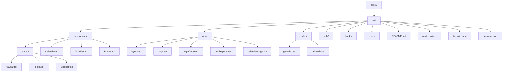

# Next.js + TypeScript SaaS Calendar App Structure

This project uses a professional, scalable file structure for a multi-user SaaS calendar app, ready for Supabase integration. The main features include:

- Main calendar view (week view Mon–Sun) with task list sidebar
- Side navbar
- Footer
- Landing page
- Login page
- Profile page
- Reusable layout components (Navbar, Footer, Sidebar)

Below is a diagram of the recommended structure:

---

# Original README 